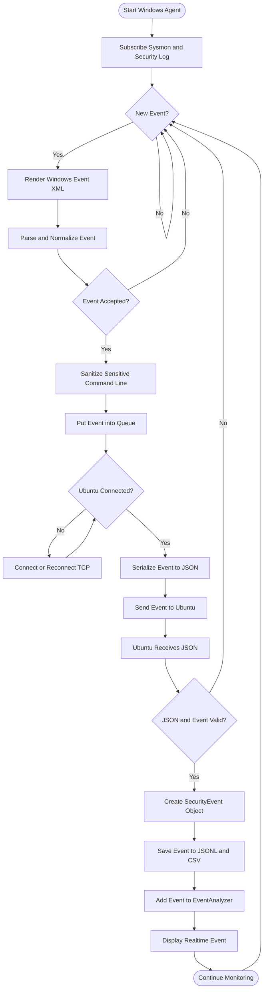
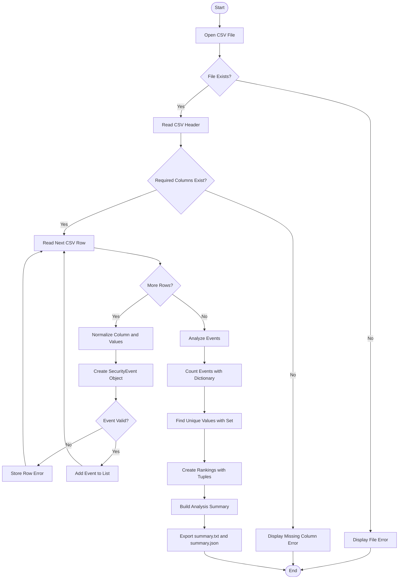

# WINWATCH - FLOWCHART

**Project:** WinWatch - Real-Time Windows Activity Monitoring System  
**Tác giả:** Nguyễn Thành Nhân

---

## 1. Flowchart Realtime Monitoring

---

## 2. Flowchart Offline CSV Analysis

---

## 3. Ý nghĩa ký hiệu

- Hình oval / rounded: Start hoặc End.
- Hình chữ nhật: bước xử lý.
- Hình thoi: điều kiện hoặc quyết định.
- Mũi tên: hướng luồng xử lý.
- Nhánh Yes/No: xử lý rẽ nhánh.
- Luồng quay lại: thể hiện vòng lặp xử lý event hoặc dòng CSV.

---

## 4. Luồng chính của WinWatch

Realtime:

Windows Event
→ Sysmon/Security Log
→ Windows Python Agent
→ Parser
→ Queue
→ TCP/JSON
→ Ubuntu Server
→ SecurityEvent
→ Validation
→ Storage
→ Analyzer
→ Realtime Output

Offline:

CSV
→ File Loader
→ Normalize
→ Validate
→ SecurityEvent List
→ EventAnalyzer
→ Statistics
→ TXT/JSON Report
