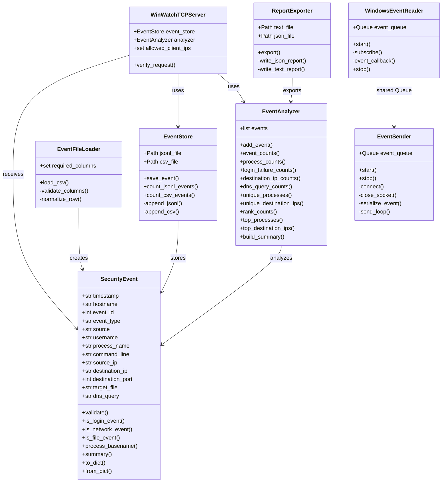

# WINWATCH - UML CLASS DIAGRAM

**Project:** WinWatch - Real-Time Windows Activity Monitoring System  
**Tác giả:** Nguyễn Thành Nhân

---

## UML Class Diagram

---

## Mô tả quan hệ chính

### SecurityEvent

Là thực thể dữ liệu trung tâm của WinWatch.

Một object đại diện cho một sự kiện Windows đã được chuẩn hóa.

### EventFileLoader → SecurityEvent

Đọc từng dòng CSV và tạo SecurityEvent object.

### EventStore → SecurityEvent

Nhận SecurityEvent hợp lệ và lưu xuống JSONL/CSV.

### EventAnalyzer → SecurityEvent

Sử dụng danh sách SecurityEvent để thống kê và xếp hạng.

### WinWatchTCPServer → SecurityEvent

Nhận JSON từ Windows và tạo SecurityEvent object.

### WinWatchTCPServer → EventStore

Gọi EventStore để lưu event.

### WinWatchTCPServer → EventAnalyzer

Đưa event hợp lệ vào bộ phân tích.

### ReportExporter → EventAnalyzer

Lấy kết quả phân tích và xuất summary.txt / summary.json.

### WindowsEventReader và EventSender

Hai module sử dụng chung Queue để tách quá trình thu thập Event Log
khỏi quá trình gửi dữ liệu qua TCP.
